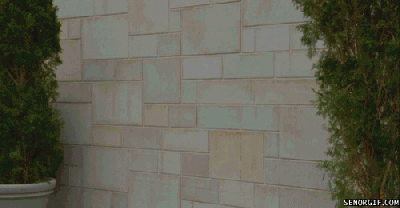

# Acceso a la presentación {data-background-image="assets/art/pc.jpg" data-background-opacity="0.25"}

## {data-background-image="assets/art/pc.jpg" data-background-opacity="0.18"}

{width=50%}

[https://pbeltran.github.io/2020-riogallego-investiga-practica](https://pbeltran.github.io/2020-riogallego-investiga-practica)

# Un acercamiento a las didácticas específicas {data-background-image="assets/art/belinda-fewings-unsplash.jpg" data-background-opacity="0.20"}

## ¿Innovación? ¿Qué es innovación?

:::::::::::::: {.columns}

::: {.column width="45%"}

{width=80%}

:::

::: {.column width="45%"}

[Bipolaridad tuitera](https://twitter.com/pbeltranp/status/1093987718051319814)

Entre el mundo de la "innovación" (ojo comillas) y el de los que detestan todo lo que huela a pedagogía o didáctica (disciplinas que no suelen distinguir), hay todo un universo por explorar.

:::
:::::::::::::

## Un fragmento sobre el que pensar {data-background-image="assets/art/belinda-fewings-unsplash.jpg" data-background-opacity="0.20"}

{width=100%}

[Enlace al fragmento de «Recuerdos del ayer»](https://youtu.be/Rg9XEL90iGk)

## Algunas preguntas a partir de este vídeo {data-background-image="assets/images/recuerdosayer.png" data-background-opacity="0.20"}

- ¿Cuál es el objeto de aprendizaje, el contenido?
- ¿Hay algo que te resulta familiar?
- ¿Hay algo que no encaja?
- En ese caso, ¿cómo se soluciona?

## ¿Te va a decir la didáctica cómo enseñar? {data-background-image="assets/art/belinda-fewings-unsplash.jpg" data-background-opacity="0.20"}

¿Tiene la didáctica un carácter prescriptivo?

> ¿Hasta qué punto, en qué forma y en qué condiciones, la didáctica puede (o incluso debe) proponer juicios valorativos y normativos que proporcionen criterios sobre cómo organizar y gestionar los procesos de estudio? (p. 26)

Gascón & Nicolás (2017). 

# Habéis elegido dos artículos para la tertulia... {data-background-image="assets/images/articles.jpg" data-background-opacity="0.2"}

## {data-background-image="assets/images/articles.jpg" data-background-opacity="0.16"}

:pushpin: Feito, R. (2010). De las competencias básicas al currículum integrado. *Qurriculum Revista de Teoría, Investigación y Práctica Educativa, 23*, 55-79. [Enlace](https://riull.ull.es/xmlui/bitstream/handle/915/13343/Q_23_%282010%29_03.pdf?sequence=1&isAllowed=y)

:pushpin: Grossman, P. (2005). Profesores de Sustancia: El conocimiento de la materia para la enseñanza *Profesorado. Revista de currículum y formación del profesorado, 9*(2), 1-25. [Enlace](https://recyt.fecyt.es/index.php/profesorado/article/view/42676)

## Algunas anotaciones sobre Feito (2010) {data-background-image="assets/images/articles.jpg" data-background-opacity="0.16"}

- Aprendizaje por competencias: qué cabe esperar de una persona después de la ESO. Para desenvolverse con soltura como trabajador, como ciudadano, como miembro de una familia, de una comunidad.
- No basta con los meros conocimientos. 
- Se es competente cuando es capaz de resolver problemas reales.
- No es de recibo **que se conozca la ley de Ohm** y al mismo tiempo se sea incapaz de explicar el funcionamiento del circuito de una linterna eléctrica.

> ¿Qué es conocer la ley de Ohm?

## {data-background-image="assets/images/articles.jpg" data-background-opacity="0.16"}

- Escuela pensada para una minoría. Carácter propedéutico y segregador. 
- Segmenta los saberes en asignaturas, lo que da lugar a descoordinaciones. 
- El alumnado es muy consciente de esta limitación. Intereses del alumnado.
- La lógica es la de la globalización curricular. 

## {data-background-image="assets/images/articles.jpg" data-background-opacity="0.16"}

- Ejemplo sobre Historia. Los alumnos memorizan fechas y los acontecimientos claves. Esto da lugar a una comprensión superficial y a un escaso interés en el tema abordado. 
- El alumnado no llega a desarrollar destrezas fundamentales como escribir, investigar, resolver problemas, destrezas que solo pueden adquirirse si se dedica el suficiente tiempo y energía para analizar una única cuestión, como pudiera ser la Gran Depresión.
- Propuesta: en lugar de aprender literatura en la clase de lengua e historia en otra clase, el alumnado aborda un tema e investiga el modo en que el arte, la literatura, los medios de comunicación describen el periodo.

## Algunos apuntes sobre Grossman (2010) {data-background-image="assets/images/articles.jpg" data-background-opacity="0.16"}

{width=50%}

Shulman’s (1986) domains of pedagogical content knowledge (PCK)

## MKT {data-background-image="assets/images/articles.jpg" data-background-opacity="0.16"}

{width=75%}

Mathematical knowledge for teaching (MKT) (Hill et al., 2008, p. 377)

## MTSK {data-background-image="assets/images/articles.jpg" data-background-opacity="0.16"}

{width=60%}

Mathematics teacher’s specialised knowledge (MTSK) (Carrillo-Yañez, et al., 2018)

## CCDM {data-background-image="assets/images/articles.jpg" data-background-opacity="0.16"}

{width=75%}

Modelo de conocimientos y competencias Godino, Batanero, Font, & Giacomone (2016). 

## CCDM {data-background-image="assets/images/articles.jpg" data-background-opacity="0.16"}

{width=75%}

Modelo de Conocimientos y Competencias Didáctico-Matemáticas (CCDM) (Godino, Batanero, Font, & Giacomone (2016). 

# Conocimiento especializado y didáctico-matemático {data-background-image="assets/art/belinda-fewings-unsplash.jpg" data-background-opacity="0.20"}

## Conocimiento especializado {data-background-image="assets/art/belinda-fewings-unsplash.jpg" data-background-opacity="0.16"}

:::::::::::::: {.columns}

::: {.column width="45%"}
{width=100%}

:::

::: {.column width="45%"}

{width=100%}

:::
:::::::::::::

## Conocimiento especializado {data-background-image="assets/art/belinda-fewings-unsplash.jpg" data-background-opacity="0.16"}

:::::::::::::: {.columns}

::: {.column width="45%"}
{width=80%}

435 = 420 + 15

:::

::: {.column width="45%"}

{width=80%}

435-147 =

= (435+10)-(147+10)

:::
:::::::::::::

## Enfoques de enseñanza {data-background-image="assets/art/clase.jpg" data-background-opacity="0.2"}

:::::::::::::: {.columns}

::: {.column width="45%"}
{width=100%}
:::

::: {.column width="45%"}

El librito es de 1986. Mismas preocupaciones que ahora.

{width=100%}

:::
:::::::::::::

## ¿Qué es enseñar a través de la resolución de problemas? {data-background-image="assets/art/clase.jpg" data-background-opacity="0.12"}

:::::::::::::: {.columns}

::: {.column width="45%"}

{width=100%}

:::

::: {.column width="45%"}

{width=100%}

:::

::::::::::::::

## ¿Qué dice la investigación? {data-background-image="assets/art/clase.jpg" data-background-opacity="0.2"}

> La investigación sugiere claramente que la RP no debe enseñarse como un tema separado en el currículo de matemáticas. De hecho, nos dice que enseñar a los estudiantes a usar estrategias generales de RP tiene poco efecto en su éxito como solucionadores de problemas.

Cai y Lester (2010).

## ¿Qué pasa si vas con un enfoque a través de la resolución de problemas a una clase acostumbrada a otra cosa? {data-background-image="assets/art/clase.jpg" data-background-opacity="0.2"}

{width=70%}

El gif es gracioso, pero un poco exagerado.

## Coherencia incansable (relentless consistency) {data-background-image="assets/art/clase.jpg" data-background-opacity="0.2"}

> La cultura de aula importa (contrato didáctico).

Es común encontrar resistencia cuando el enfoque que plantea el docente es a través de la RP y la cultura de aula es todo lo contrario. ¿Qué hacer? 

> Relentless consistency (¿coherencia incansable?) Brown y Coles (2013) :muscle:

## Conocimiento especializado y didáctico-matemático para valorar "metodologías" {data-background-image="assets/art/belinda-fewings-unsplash.jpg" data-background-opacity="0.20"}

:::::::::::::: {.columns}

::: {.column width="45%"}

> Flipped classroom

Lo que se hace no es invertir nada, sino desplazar. Es dar la **teoría** en casa. Y son deberes.

:::

::: {.column width="45%"}

> Gamificación 

No es lo mismo que el uso de juegos como recurso didáctico (al menos, en matemáticas).

:::
:::::::::::::

## Valorar referencias {data-background-image="assets/images/paradigmapatata.jpg" data-background-opacity="0.24"}

:::::::::::::: {.columns}

::: {.column width="20%"}

{width=100%}

:::

::: {.column width="40%"}

{width=90%}

:::

::: {.column width="40%"}

{width=90%}

:::
:::::::::::::

Evidencia: ¿qué evidencia?

:::::::::::::: {.columns}

::: {.column width="45%"}

{width=100%}

:::

::: {.column width="45%"}

{width=40%}

[A reply to Mr. Barton, de Andrew Blair](http://www.inquirymaths.com/posts/areplytomrbarton)

:::
:::::::::::::

## Enseñanza y aprendizaje de contenidos concretos {data-background-image="assets/art/belinda-fewings-unsplash.jpg" data-background-opacity="0.20"}

:::::::::::::: {.columns}

::: {.column width="45%"}

{width=60%}

{width=60%}

:::

::: {.column width="45%"}

{width=50%}

{width=50%}

:::
:::::::::::::

# Contenidos concretos {data-background-image="assets/images/medida2.jpg" data-background-opacity="0.2"}

## Probabilidad {data-background-image="assets/images/prob1.jpg" data-background-opacity="0.2"}

:::::::::::::: {.columns}

::: {.column width="45%"}

{width=80%}  

:::

::: {.column width="45%"}

{width=100%}  

Batanero (2005).

:::
:::::::::::::

## Probabilidad {data-background-image="assets/images/prob1.jpg" data-background-opacity="0.2"}

:::::::::::::: {.columns}

::: {.column width="45%"}

{width=100%}  

:::

::: {.column width="45%"}

{width=100%}  

:::
:::::::::::::

## Probabilidad {data-background-image="assets/images/prob1.jpg" data-background-opacity="0.2"}

{width=100%}  

## Probabilidad {data-background-image="assets/images/prob1.jpg" data-background-opacity="0.2"}

{width=100%}  

[Enlace al hilo completo](https://twitter.com/pbeltranp/status/1185842437215916032)

## Estadística {data-background-image="assets/images/basket.jpg" data-background-opacity="0.14"}

:::::::::::::: {.columns}

::: {.column width="45%"}

Partido de basket. Queda un minuto y el entrenador tiene que decidir a qué jugadora sacar. ¿A quién elegirá?

- Si va perdiendo de 8 puntos.
- Si va ganando de 2 puntos.

:::

::: {.column width="45%"}

{width=100%}  

{width=80%}  

:::
:::::::::::::
 
## Estadística {data-background-image="assets/images/basket.jpg" data-background-opacity="0.14"}

{width=100%}  
 
[Enlace a la secuencia](https://tierradenumeros.com/post/hilo-medidas-de-dispersion/)

## Estadística: vía intuitiva {data-background-image="assets/images/basket.jpg" data-background-opacity="0.14"}

{width=60%}  

## Estadística: vía intuitiva {data-background-image="assets/images/basket.jpg" data-background-opacity="0.14"}

{width=100%}  

## Estadística: vía intuitiva {data-background-image="assets/images/basket.jpg" data-background-opacity="0.14"}

{width=46%}  

## Estadística: vía intuitiva {data-background-image="assets/images/basket.jpg" data-background-opacity="0.14"}

{width=100%}  

## Números {data-background-image="assets/images/contar2.jpg" data-background-opacity="0.2"}

:::::::::::::: {.columns}

::: {.column width="45%"}
{width=100%}

[Enlace al vídeo](https://www.youtube.com/watch?v=E2UeSjGM-Aw)
:::

::: {.column width="45%"}

{width=100%}

:::
:::::::::::::

## Números {data-background-image="assets/images/contar2.jpg" data-background-opacity="0.2"}

:::::::::::::: {.columns}

::: {.column width="35%"}
{width=100%}

:::

::: {.column width="65%"}

{width=100%}

:::
:::::::::::::

## Números {data-background-image="assets/images/contar2.jpg" data-background-opacity="0.2"}

{width=90%}

## Números {data-background-image="assets/images/contar2.jpg" data-background-opacity="0.2"}

{width=80%}

## Números racionales {data-background-image="assets/images/medida2.jpg" data-background-opacity="0.2"}

:::::::::::::: {.columns}

::: {.column width="40%"}

{width=100%}

:::

::: {.column width="60%"}

> Los diferentes significados son un conocimiento especializado.

- Parte-todo.
- Medida.
- Cociente.
- Razón.
- Probabilidad.

:::
:::::::::::::

## Números racionales {data-background-image="assets/images/medida2.jpg" data-background-opacity="0.2"}

{width=80%}

Fichas de [SergioMJGR](https://twitter.com/SergioMJGR) y [auroradp64](https://twitter.com/auroradp64), basadas en trabajos de Escolano, Gairín y otros.

## Números racionales {data-background-image="assets/images/medida2.jpg" data-background-opacity="0.2"}

{width=90%}

## Números racionales {data-background-image="assets/images/medida2.jpg" data-background-opacity="0.2"}

{width=90%}

## Números racionales {data-background-image="assets/images/medida2.jpg" data-background-opacity="0.2"}

{width=70%}

## Números racionales {data-background-image="assets/images/medida2.jpg" data-background-opacity="0.2"}

{width=52%}

## Álgebra y negativos {data-background-image="assets/images/negativos2.jpg" data-background-opacity="0.16"}

La propuesta de Eva Cid (2017) se apoya en un progresivo quehacer algebraico, de forma similar al recorrido histórico que condujo al reconocimiento de los negativos como números. 

:bulb::bulb::bulb:

> Se trata de un importante cambio conceptual.

[Obstáculos](http://www.quadernsdigitals.net/datos/hemeroteca/r_40/nr_460/a_6233/6233.pdf)

## Álgebra y negativos {data-background-image="assets/images/negativos2.jpg" data-background-opacity="0.16"}

{width=80%}

## Álgebra y negativos {data-background-image="assets/images/negativos2.jpg" data-background-opacity="0.16"}

{width=80%}

## Funciones {data-background-image="assets/images/funciones1.jpg" data-background-opacity="0.2"}

Una función puede presentarse mediante: 

- Descripciones verbales (orales o escritas)
- Representaciones gráficas
- Tablas
- Fórmulas o expresiones algebraicas

> No hacen falta fórmulas ni expresiones algebraicas para introducir las características globales (tendencia, periodicidad, etc.), y locales de las funciones (extremos, cortes, etc.).

## El lenguaje de funciones y gráficas {data-background-image="assets/images/funciones1.jpg" data-background-opacity="0.2"}

:::::::::::::: {.columns}

::: {.column width="35%"}

{width=60%}  

[Descargar](https://sede.educacion.gob.es/publiventa/el-lenguaje-de-funciones-y-graficas/pedagogia/1065)

:::

::: {.column width="65%"}

Estos materiales sirven para ayudar a los alumnos a desarrollar fluidez en la utilización del lenguaje matemático de gráficas, tablas y álgebra de cara a describir y analizar situaciones del mundo real.

:::
:::::::::::::

## Funciones {data-background-image="assets/images/funciones1.jpg" data-background-opacity="0.2"}

{width=65%}  

## Funciones {data-background-image="assets/images/funciones1.jpg" data-background-opacity="0.2"}

{width=80%}  

## Funciones: preguntas de examen {data-background-image="assets/images/funciones1.jpg" data-background-opacity="0.2"}

{width=80%}  

## Funciones: los exámenes dan mucho juego {data-background-image="assets/images/funciones1.jpg" data-background-opacity="0.2"}

{width=80%}

[Mejores respuestas aquí](https://mobile.twitter.com/pbeltranp/status/1126743840168103936)

## Geometría: lugares geométricos  {data-background-image="assets/images/areas.jpg" data-background-opacity="0.2"}

:::::::::::::: {.columns}

::: {.column width="45%"}
{width=100%}

Fuente: Arnal-Bailera (2013)
:::
::: {.column width="45%"}

Abdel y Conrad están en los puntos del parque que tienes marcados en la foto. Tienes que encontrar varios puntos (al menos cuatro) que estén a la misma distancia de los dos. Puedes comprobar las distancias midiendo con Geogebra.

:::
:::::::::::::

## Geometría: definiciones {data-background-image="assets/images/areas.jpg" data-background-opacity="0.2"}

:::::::::::::: {.columns}

::: {.column width="45%"}

{width=100%}

Fuente: prácticas de Didáctica de la Geometría. Área de Didáctica de la Matemática, @unizar.

:::

::: {.column width="45%"}

{width=100%}

[Enlace al vídeo](https://www.youtube.com/watch?v=QbZ0nkI3A9k)

:::
:::::::::::::

## Geometría: áreas {data-background-image="assets/images/areas.jpg" data-background-opacity="0.2"}

{width=80%}

# ¿Por qué enseñar matemáticas? {data-background-image="assets/art/student.jpg" data-background-opacity="0.20"}

## ¿Por qué enseñar matemáticas? (Ernest, 2000) {data-background-image="assets/art/student.jpg" data-background-opacity="0.16"}

- No existe LA matemática escolar. 
- La utilidad de las matemáticas académicas está sobrevalorada. *Nuestra sociedad vive un incesante proceso de matematización, pero esto es algo que opera a un nivel invisible para la mayoría*.
- Los objetivos de la educación matemática no pueden considerarse de forma aislada a su contexto social (intencionalidad).

> Dos dimensiones a la hora de diseñar el currículo: *capacidad* (o habilidad, o competencia, para entendernos) y *apreciación* de las matemáticas.

## Objetivos de las matemáticas escolares {data-background-image="assets/art/student.jpg" data-background-opacity="0.16"}

:::incremental

- Obj1. Reproducir habilidades matemáticas y capacidades basadas en el conocimiento. Típico del currículo reproductivo. 
- Obj2. Desarrollar habilidades creativas en matemáticas. Aprender a ser creativo y a expresarse vía trabajos de investigación, resolución de problemas, diferentes representaciones, etc. 
- Obj3. Desarrollar habilidades matemáticas que empoderen y una apreciación crítica de las aplicaciones y usos sociales de las matemáticas. 
- Obj4. Desarrollar una apreciación interna de las matemáticas: sus grandes ideas y su naturaleza. Es decir, las matemáticas como una contribución única a la cultura humana, con unos conceptos y un sentido de la estética propios.
:::

## ¿Qué matemáticas queremos? {data-background-image="assets/art/student.jpg" data-background-opacity="0.16"}
 
Y es que las matemáticas serán maravillosas, pero también pueden servir para discriminar y fomentar la desigualdad de oportunidades.

 > ¿De qué matemáticas estamos hablando? ¿Qué subconjunto de objetivos persiguen?
 

## Enseñar matemáticas humanistas y enseñar matemáticas de forma humanista {data-background-image="assets/art/student.jpg" data-background-opacity="0.16"}

En un ensayo genial, Brown (1996) pone sobre la mesa que no es lo mismo enseñar matemáticas humanistas que enseñar matemáticas de forma humanista.

{width=70%}

# Terminando {data-background-image="assets/art/conclusiones.jpg" data-background-opacity="0.2"}

## Cultura científica del profesor de matemáticas y profesionalización {data-background-image="assets/art/conclusiones.jpg" data-background-opacity="0.2"}

:::::::::::::: {.columns}

::: {.column width="45%"}

> Lista de los RR.MM.

- Ratios adecuadas.
- Menos horas lectivas.
- Programación a partir del currículo.
- Formación en horario de trabajo.
- Codocencia o *lesson study*. 

:::

::: {.column width="45%"}

- ¿Cuántos profesores acudimos a jornadas y congresos?
- ¿Tenemos incentivos y facilidades para ello?
- ¿Cuántos sabemos qué es la FESPM?
- ¿Cuántos sabemos qué es la SEIEM?

:::
:::::::::::::

##

{width=85%}

# Créditos y referencias {data-background-image="assets/art/credits.jpg" data-background-opacity="0.1"}

## Lista de referencias {data-background-image="assets/art/credits.jpg" data-background-opacity="0.1"}

Arce, M. (2018). El cuaderno de matemáticas: un instrumento relevante en las aulas que suele pasar desapercibido. _La Gaceta de la RSME, 21_(2), 367-387.

Arce, M., Conejo, L., & Muñoz, J. M. (2019). _Aprendizaje y enseñanza de las matemáticas_. Madrid: Síntesis.

Arnal-Bailera, A. (2013). _Mediación tecnológica en la enseñanza y el aprendizaje de geometría con grupos de riesgo_. Tesis doctoral. Universidad Autónoma de Barcelona. [Enlace](https://www.tdx.cat/handle/10803/128998)

Batanero, C. (2005). Significados de la probabilidad en la educación secundaria. _RELIME, 8_(3), 247-263. [Enlace](https://www.redalyc.org/pdf/335/33508302.pdf)

Beltrán-Pellicer, P., & Cárdenas, J. A. (2019). Polígrafos y canicas en Desmos como ejemplos de propuestas éticas de enseñanza y aprendizaje en matemáticas. _UNO, 84_, 40-44.

##

Beltrán-Pellicer, P., Giacomone, B., & Burgos, M. (2018). Online educational videos according to specific didactics: the case of mathematics / Los vídeos educativos en línea desde las didácticas específicas: el caso de las matemáticas. _Cultura y Educación, 30_(4), 633-662. [Enlace](https://www.tandfonline.com/eprint/r8gbHE2dM75Z3t3wdE7U/full)

Beltrán-Pellicer, P., Godino, J. D. (2019). An onto-semiotic approach to the analysis of the affective domain in mathematics education. _Cambridge Journal of Education_, 1-20. [Enlace](https://www.tandfonline.com/eprint/KimkMTSJt9uGibVg9Gej/full?target=10.1080/0305764X.2019.1623175) 

Beltrán-Pellicer, P., Ricart, M., & Estrada, A. (2019). Una experiencia sobre el diseño de juegos como recurso para desarrollar la competencia didáctico-matemática en probabilidad con docentes de infantil y primaria. En J. M. Contreras, M. M. Gea, M. M. López-Martín, & E. Molina-Portillo (Eds.) _Actas del Tercer Congreso Internacional Virtual de Educación Estadística_ (pp. 1-10). [Enlace](https://www.ugr.es/~fqm126/civeest.html)

##

Brown, L., & Coles, A. (2013).On doing the same problem – first lessons and relentless consistency. En C. Margolinas (Ed.), _Task design in mathematics education (Proceedings of the International Commission on Mathematical Instruction Study 22_, pp. 617–626), Oxford, UK. [Enlace](http://hal.archives-ouvertes.fr/hal-00834054)

Cai, J., & Lester, F. (2010). Why is Teaching with Problem Solving Important to Student Learning? _NCTM, 13_(12), 1–6. [Enlace](https://www.nctm.org/uploadedFiles/Research_and_Advocacy/research_brief_and_clips/Research_brief_14_-_Problem_Solving.pdf)

Carrillo-Yañez, J., Climent, N., Montes, M., Contreras, L. C., Flores-Medrano, E., Escudero-Ávila, D., ... & Ribeiro, M. (2018). The mathematics teacher’s specialised knowledge (MTSK) model. *Research in Mathematics Education, 20*(3), 236-253.

Cid, E. (2015). _Obstáculos epistemológicos en la enseñanza de los números negativos_. Tesid doctoral. Universidad de Zaragoza. [Enlace](http://www.atd-tad.org/documentos/obstaculos-epistemologicos-en-la-ensenanza-de-los-numeros-negativos-tesis-doctoral/)

##

English, L. D., & Gainsburg, J. (2016). Problem Solving in a 21st-Century Mathematics Curriculum. En L. D. English, & D. Kirshner (Eds.), _Handbook of International Research in Mathematics Education_, pp. 313-335. Routledge.

Ernest, P. (2000). Why Teach Mathematics. En J. White & S. Bramall, *Why Learn Maths?*. London University Institute of Education: London. [Enlace](http://socialsciences.exeter.ac.uk/education/research/centres/stem/publications/pmej/why.htm)

Escolano, R. (2007.) _Enseñanza del número racional positivo en Educación Primaria: un estudio desde modelos de medida y cociente._ Tesis doctoral. Universidad de Zaragoza. [Enlace](https://zaguan.unizar.es/record/84666) 

Escolano, R., & Gairín, J. M. (2005). Modelos de medida para la enseñanza del número racional en Educación Primaria. _Unión, 1_, 17–35.

Gairín, J. M., & Sancho, J. (2002). _Números y algoritmos_. Madrid: Síntesis.

##

Gascón, J., & Nicolás, P. (2017). Can Didactics Say How to Teach? The Beginning of a Dialogue between the Anthropological Theory of the Didactic and Other Approaches. _For the Learning of Mathematics, 37_(3), 9–13.

Godino, J. D. (2013). Indicadores de idoneidad didáctica de procesos de enseñanza y aprendizaje de las matemáticas. _Cuadernos de Investigación y Formación En Educación Matemática, 8_(11), 111–132. [Enlace]( https://goo.gl/tXDyVJ)

Godino, J. D., Batanero, C., & Cañizares, M. J. (1987). _Azar y probabilidad. Fundamentos didácticos y propuestas curriculares_. Madrid: Síntesis.

##

Godino, J. D., Batanero, C., Font, V., & Giacomone, B. (2016). Articulando conocimientos y competencias del profesor de matemáticas: el modelo CCDM. En C. Fernández, J. L. González, F. J. Ruiz, T. Fernández, & A. Berciano (Eds.), _Investigación en Educación Matemática XX_ (pp. 288–297). Málaga: SEIEM. [Enlace](http://funes.uniandes.edu.co/8859/)

Gómez-Chacón, I. M. (2000). _Matemática emocional: Los afectos en el aprendizaje matemático._ Madrid: Narcea.

##

Hill, H.C., Ball, D.L., & Schilling, S.G. (2008). Unpacking pedagogical content knowledge: Conceptualizing and measuring teachers topic specific knowledge of students. *Journal for Research in Mathematics Education, 39*(4), 372-400.

Martínez-Juste, S., Muñoz-Escolano, J. M., & Oller-Marcén, A. M. (2019). Una experiencia de investigación-acción para la enseñanza de la proporcionalidad compuesta._ Enseñanza de las ciencias, 37_(2), 85-106. [Enlace](https://www.raco.cat/index.php/Ensenanza/article/download/356155/448100)

##

Martínez-Juste, S., Muñoz-Escolano, J. M., Oller-Marcén, A. M. y Pecharromán, C. (2014). Una propuesta innovadora para la enseñanza de la proporcionalidad aritmética en el primer ciclo de ESO. En Consejería de Educación de la Junta de Castilla y León (Ed.), Las nuevas metodologías en la enseñanza y el aprendizaje de las Matemáticas (pp. 459-470). Segovia: Academia de Artillería de Segovia. [Enlace](https://riemann.unizar.es/grupodidactica/data/uploads/martinez-munoz-oller-pecharroman-2015-proporcionalidad.pdf)

Oller-Marcén, A. (2012). _Proporcionalidad aritmética: una propuesta didáctica para alumnos de secundaria_. Tesis doctoral. Universidad de Valladolid. [Enlace](http://uvadoc.uva.es/handle/10324/1118)

##

Ricart, M., Beltrán-Pellicer, P. y Estrada, A. (2019). Actividad scaffolding en geometría para desarrollar habilidades de argumentación y clasificación en futuros maestros de Educación Infantil. En J. M. Marbán, M. Arce, A. Maroto, J. M. Muñoz-Escolano y Á. Alsina (Eds.), _Investigación en Educación Matemática XXIII_ (pp. 503-512). Valladolid: SEIEM.

Shulman, L. S. (1986). Those who understand, knowledge growth in teaching. *Educational Researcher, 15*(2), 4-14.

## Créditos {data-background-image="assets/art/credits.jpg" data-background-opacity="0.1"}

_Compartir el conocimiento de forma libre es una buena práctica._

En estas diapositivas se han utilizado materiales disponibles en abierto y se han citado las fuentes correspondientes. El contenido de la presentación está publicado con licencia Creative Common [CC-BY-SA-4.0](https://creativecommons.org/licenses/by-sa/4.0/legalcode.es), lo que quiere decir que puedes compartirla y adaptarla, citándome (Pablo Beltrán-Pellicer) y poniendo un enlace a [https://pbeltran.github.io/investigacion-practica-ene2020](https://pbeltran.github.io/investigacion-practica-ene2020).

_Siéntete libre de trabajar con este material y de contactar conmigo para compartir tus reflexiones._

## {data-background-image="assets/art/credits.jpg" data-background-opacity="0.1"}

Presentación realizada con  <a href="https://revealjs.com/#/">Reveal.js</a>, <a href="https://pandoc.org/">Pandoc</a>, <a href="https://www.mathjax.org/">MathJax</a> y <a href="https://www.markdownguide.org/">Markdown</a>. El código fuente está disponible en [https://github.com/pbeltran/investigacion-practica-ene2020](https://github.com/pbeltran/investigacion-practica-ene2020)

Los gifs se han obtenido de [Giphy](https://giphy.com/).

La fuente de las imágenes es propia, salvo las que se ha citado la fuente en su diapositiva y las de dominio público obtenidas en [Unsplash](https://unsplash.com). 

